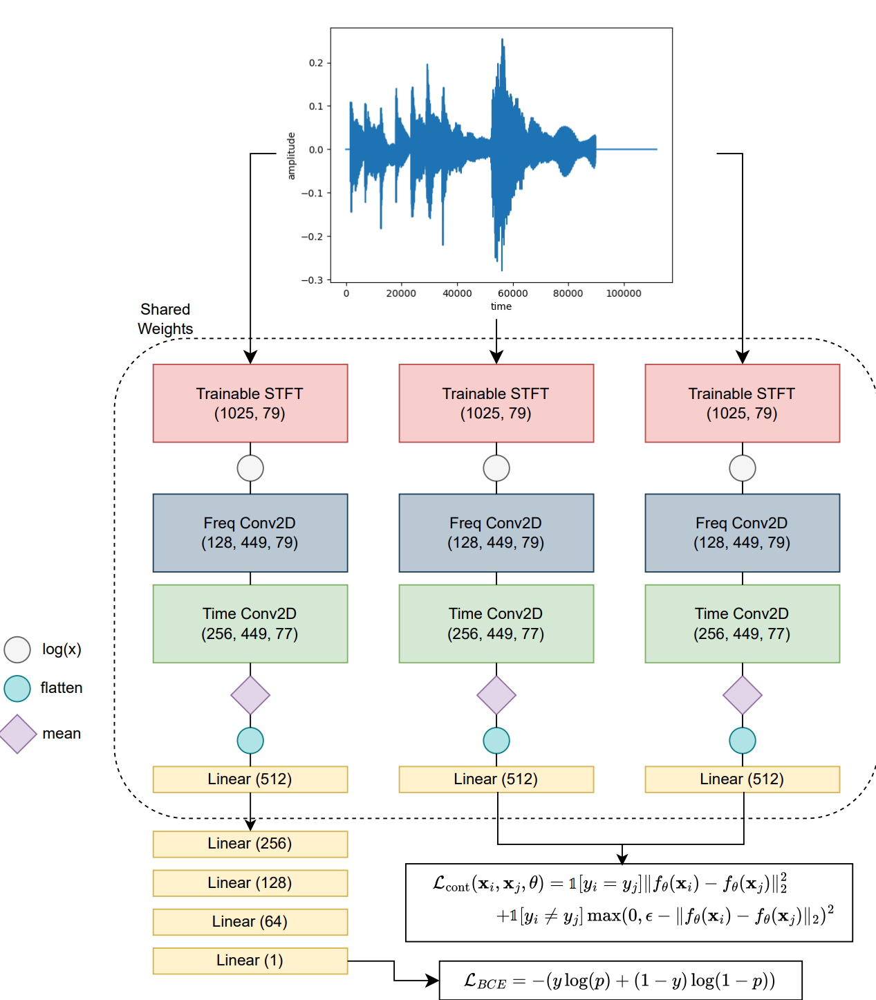

# Contrastive-Deep-Fake-Audio-Detection

This project implements a contrastive pretraining method for detecting deep fake audio samples using a deep convolutional neural network.It uses a Saimese twin model for contrastive pretraining.
This project is implemented in Pytorch, and trained on an 8GB RTX 3070.



## Requirements 
Required Libraries:
```
pytorch
librosa
nnAudio
pandas
numpy
matplotlib
sklearn
```

Using Anaconda: 
```
conda env create -f environment.yml
```

## Data
To download the data visit the ASV challenge page:
https://www.asvspoof.org/database

We use the ASVSpoof2019 dataset.
## Training

First configure the options file for training:
```
./config.py
```
To perform contrastive pretraining: 
```
python train_contrastive
```
The trained model can be found in ```./results```.

To train: 
```
python train.py
```

To test:
```
python test.py
```
